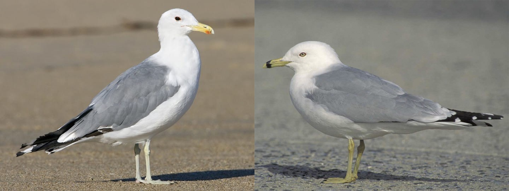

# FGVR Tensorflow Baseline
This repo contains training code for FGVR classification using TensorFlow. This implementation achieves comparable state-of-the-art results.

Checkout the [Wiki](https://github.com/ahmdtaha/fgvr/wiki) for more technical discussion.

FVGR is a classification task where intra category visual differences are small and can be overwhelmed by factors such as pose, viewpoint, or location of the object in the image. For instance, the following image shows a California gull (left) and a Ringed-beak gull (Right). The beak pattern difference is the key for a correct classification. Such a difference is tiny when compared to the intra-category variations like pose and illumination.

FVGR dataset typically involve animal species, models of cars or aircrafts. The following table list six well-known FGVR datasets.

| Dataset       | Num Classes | Avg samples Per Class | Train Size | Val Size | Test Size |
|---------------|-------------|-----------------------|------------|----------|-----------|
| Flowers-102   | 102         | 10                    | 1020       | 1020     | 6149      |
| CUB-200-2011  | 200         | 29.97                 | 5994       | N/A      | 5794      |
| Stanford Cars          | 196         | 41.55                 | 8144       | N/A      | 8041      |
| NABirds       | 550         | 43.5                  | 23929      | N/A      | 24633     |
| Aircrafts     | 100         | 100                   | 3334       | 3333     | 3333      |
| Stanford Dogs | 120         | 100                   | 12000      | N/A      | 8580      |

## Requirements

* Python 3+ [Tested on 3.4.7]
* Tensorflow 1+ [Tested on 1.8]

## Datasets
I prepare my datasets in an un-conviention way. `dataset_sample` folder provides an example for the cars dataset. Instead of caffe style, listing files and labels in txt file, I use csv file. Reading dataset content in Excel is more appealing, to me, than txt file. To use caffe txt dataset style, make sure to modify `CarsTupleLoader` and `BaseTupleLoader`. This should be trivial since these classes return a list of filenames and labels

## Preliminary Results

Augmentation using random cropping and horizontal flipping on. No color distortion, vertical flipping or any complex augmentation is employed.
The results are preliminary because I didn't wait for till max_iters. Other datasets results and other models like resnet50 will be added later.

| Dataset       | DenseNet161 | ResNet50 V2 |
|---------------|-------------|-------------|
| Flowers-102   | 93.39         | 85.59         |
| CUB-200-2011  | 82.2        | 69.43         |
| Stanford Cars | 91.13       | 86.84         |
| NABirds       | 78.80         | 65.06         |
| Aircrafts     | 88.65         | 83.49         |
| Stanford Dogs | 81.60         | 70.36         |

## Running

`base_config` contains all the parameters needed to train the model. The main function in `fgvr_train.py` shows how to set these parameters.

Run `python fgvr_train.py `

## Credits:

The following deserve credit for the tips and help provided to finish this code and achieve the reported results

* [Accumulated Gradient in Tensorflow.](https://stackoverflow.com/questions/46772685/how-to-accumulate-gradients-in-tensorflow)
* [Training and Evaluating at the same time](https://github.com/tensorflow/tensorflow/issues/5987).
* [Batch Level Augmentation](https://becominghuman.ai/data-augmentation-on-gpu-in-tensorflow-13d14ecf2b19).
* [Pretrained-DenseNet](https://github.com/pudae/tensorflow-densenet)

### TODO LIST
* [Done] Write a Wiki about Accumulated Gradient in Tensorflow
* [Done] Write a Wiki about Batch normalization and how to train and evaluate concurrently.
* [Done] Report results of these fgvr datasets
* [Done] Add ResNet implementation
* [Done] Add other dataset loaders
* Add separate evaluation.py to eval a trained model

## Contributor list
1. [Ahmed Taha](http://www.cs.umd.edu/~ahmdtaha/)

**Both tips to improve the code and pull requests to contribute are very welcomed**

